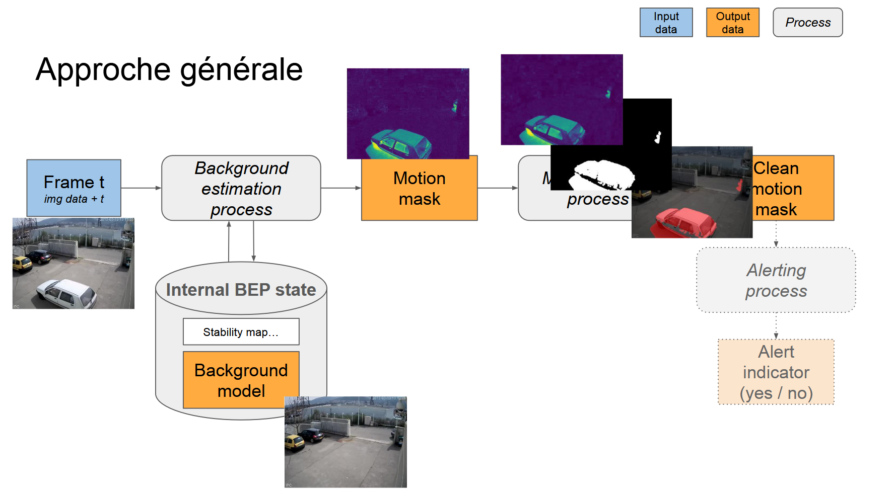
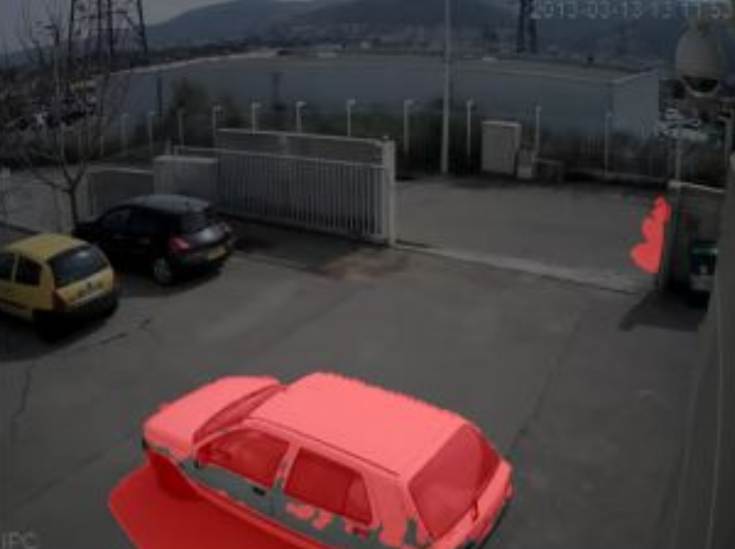
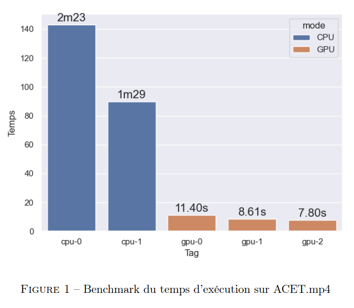

# Project done by Matis, Ewan, Virgile and Lylian
# Project :

<p align="center">
  
  <br>
  <em>Project Architecture</em>
</p>

# GPGPU Video Motion Estimation : GStreamer Plugin

A GStreamer plugin that separates moving objects from the background in a video stream by computing a per-frame change mask. Most of the underlying operations are pixel-local, making the pipeline a strong candidate for GPU acceleration via CUDA. The project progressively ports and optimizes a CPU pipeline to the GPU, benchmarking each step along the way.

## Pipeline

The change mask is computed in three stages:

1. **Background estimation** : builds and continuously updates a model of the static background.
2. **Motion mask cleanup**
   - Morphological opening (erosion → dilation)
   - Hysteresis thresholding
3. **Mask application** : overlays the resulting motion mask on the original frame.

<p align="center">
  
  <br>
  <em>Output Result</em>
</p>

### 1. Background Estimation

For every frame, a distance map is computed pixel-wise using the Euclidean norm in the **CIE 1976 L\*a\*b\*** color space (chosen for its perceptual uniformity). Each pixel keeps an internal state of :
- `background` : the current estimated background value
- `candidate` : a potential next background value
- `time` : number of frames since the background last changed significantly

### 2. Morphological Opening

- **Erosion** : each pixel is replaced by the minimum value among its neighbors within a given radius.
- **Dilation** : each pixel is replaced by the maximum value among its neighbors within a given radius.

### 3. Hysteresis Thresholding

Filters out minor, irrelevant mask changes using two thresholds and a propagation rule :
- Below the **low threshold** : rejected.
- Above the **high threshold** : validated.
- Between the two : validated only if adjacent to an already-validated pixel.

Two propagation strategies were implemented and compared : **single-pass** vs. **recursive** propagation. 

Benchmarking showed that restricting propagation to pixels that were initially above the high threshold (single-pass) was sufficient, so we kept that strategy.

### 4. Mask Application

The CPU implementation reads the mask and the original frame and, for every pixel where the mask value is non-zero, overlays a semi-transparent red marker to highlight motion.

## Implementation Versions

Optimizations are cumulative, each version includes all improvements from the previous one.

| Version | Description |
|---|---|
| `cpu-0` | First working CPU pipeline. |
| `cpu-1` | Reduced number of color-space conversions. |
| `gpu-0` | Naive port of the full pipeline to the GPU (CUDA). |
| `gpu-1` | Reduced number of computations per sRGB → L\*a\*b\* conversion. |
| `gpu-2` | Single-precision instead of double-precision floats; shared memory used in the morphological opening kernel. |

<p align="center">
  
  <br>
</p>

# Inference

Using the project :

0. If you're using Nix on the OpenStack, use the provided flake.

```
nix develop
```

1. Build the project (in Debug or Release) with cmake

```
export buildir=... # pas dans l'AFS
cmake -S . -B $builddir -DCMAKE_BUILD_TYPE=Debug
```

or

```
cmake -S . -B $buildir -DCMAKE_BUILD_TYPE=Release
```

2.
Run with

```
$buildir/stream --mode=[gpu,cpu] <video.mp4> [--output=output.mp4]
```

3.
Edit your cuda/cpp code in */Compute.*
